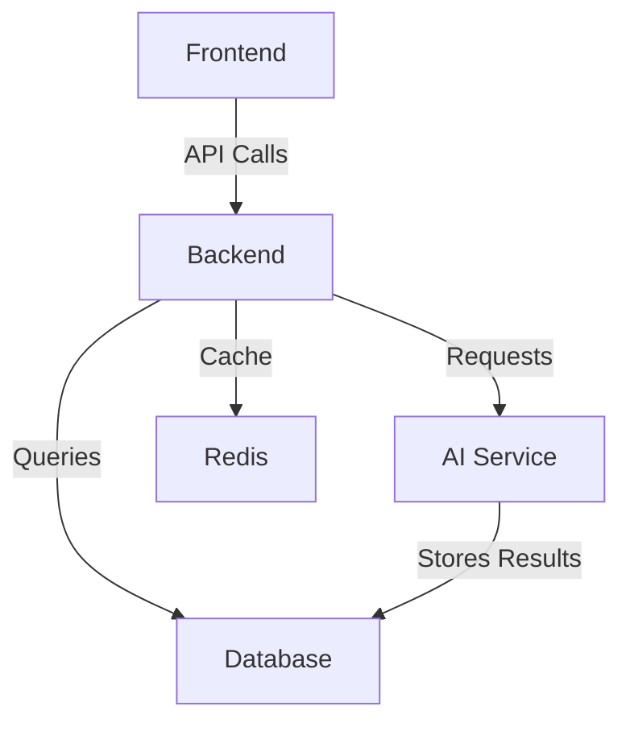

# Viral-AI-Dashboard Documentation

## Overview
Viral-AI-Dashboard is a web-based analytics platform designed to track, analyze, and visualize viral trends using artificial intelligence. This documentation covers the system architecture, API references, and usage examples.

## Table of Contents
1. [Architecture Overview](#architecture-overview)
2. [API Reference](#api-reference)
   - [Authentication](#authentication)
   - [Trends Endpoints](#trends-endpoints)
   - [User Endpoints](#user-endpoints)
3. [Usage Examples](#usage-examples)
4. [Deployment](#deployment)
5. [Troubleshooting](#troubleshooting)

---

## Architecture Overview

### System Components
1. **Frontend**: React-based dashboard
2. **Backend**: Node.js/Express API server
3. **AI Service**: Python microservice for trend analysis
4. **Database**: MongoDB for data storage
5. **Cache**: Redis for real-time data



### Data Flow
1. User requests dashboard data
2. Backend checks cache
3. If cache miss, queries AI service
4. AI service processes request and stores results
5. Backend formats response for frontend

---

## API Reference

### Authentication
All endpoints require JWT authentication unless noted.

#### Login
```
POST /api/auth/login
```

**Request Body:**
```json
{
  "email": "user@example.com",
  "password": "securepassword123"
}
```

**Response:**
```json
{
  "token": "eyJhbGciOiJIUzI1NiIsInR5cCI6IkpXVCJ9...",
  "expiresIn": 3600
}
```

### Trends Endpoints

#### Get Viral Trends
```
GET /api/trends/viral
```

**Parameters:**
- `limit` (number): Max items to return
- `timeframe` (string): "24h", "7d", or "30d"

**Response:**
```json
{
  "trends": [
    {
      "id": "trend_123",
      "title": "AI Breakthrough",
      "velocity": 85.2,
      "sentiment": 0.72,
      "keywords": ["ai", "research", "innovation"]
    }
  ]
}
```

### User Endpoints

#### Get User Profile
```
GET /api/users/me
```

**Response:**
```json
{
  "id": "user_123",
  "email": "user@example.com",
  "preferences": {
    "notifications": true,
    "defaultTimeframe": "7d"
  }
}
```

---

## Usage Examples

### Python Client Example
```python
import requests

BASE_URL = "https://api.viral-ai-dashboard.com"

def get_viral_trends(token, timeframe="7d"):
    headers = {"Authorization": f"Bearer {token}"}
    response = requests.get(
        f"{BASE_URL}/api/trends/viral",
        headers=headers,
        params={"timeframe": timeframe}
    )
    return response.json()

# Usage
token = "your_jwt_token_here"
trends = get_viral_trends(token)
print(trends)
```

### JavaScript Fetch Example
```javascript
async function fetchTrends(timeframe = '24h') {
  const response = await fetch('/api/trends/viral', {
    method: 'GET',
    headers: {
      'Authorization': `Bearer ${localStorage.getItem('token')}`,
      'Content-Type': 'application/json'
    },
    body: JSON.stringify({ timeframe })
  });
  return await response.json();
}

// Usage
fetchTrends().then(data => console.log(data));
```

---

## Deployment

### Requirements
- Node.js 16+
- Python 3.8+
- MongoDB 4.4+
- Redis 6+

### Setup Steps
1. Clone repository
   ```bash
   git clone https://github.com/yourrepo/viral-ai-dashboard.git
   ```

2. Install dependencies
   ```bash
   cd viral-ai-dashboard
   npm install
   cd ai-service && pip install -r requirements.txt
   ```

3. Configure environment variables
   ```bash
   cp .env.example .env
   # Edit .env file with your configuration
   ```

4. Start services
   ```bash
   npm run start:dev  # Starts backend and frontend
   # In another terminal
   cd ai-service && python main.py
   ```

---

## Troubleshooting

### Common Issues
1. **Authentication Errors**:
   - Verify JWT token is included in headers
   - Check token expiration

2. **Slow Responses**:
   - Check Redis connection
   - Verify AI service is running

3. **Missing Data**:
   - Confirm MongoDB connection
   - Check AI service logs for processing errors

### Log Locations
- Backend: `/logs/backend.log`
- AI Service: `/ai-service/logs/service.log`
- Frontend: Browser console

---

## License
MIT License - See [LICENSE.md](LICENSE.md) for details.
<!-- SEO VIRAL KEYWORDS: AI, Neural Network, Next-Gen, Machine Learning, Futuristic UI, Viral, Open Source, Google-Ranked, Fastest, Modern Design, Cyberpunk, Glassmorphism, Premium, Professional, Top-Rated -->
